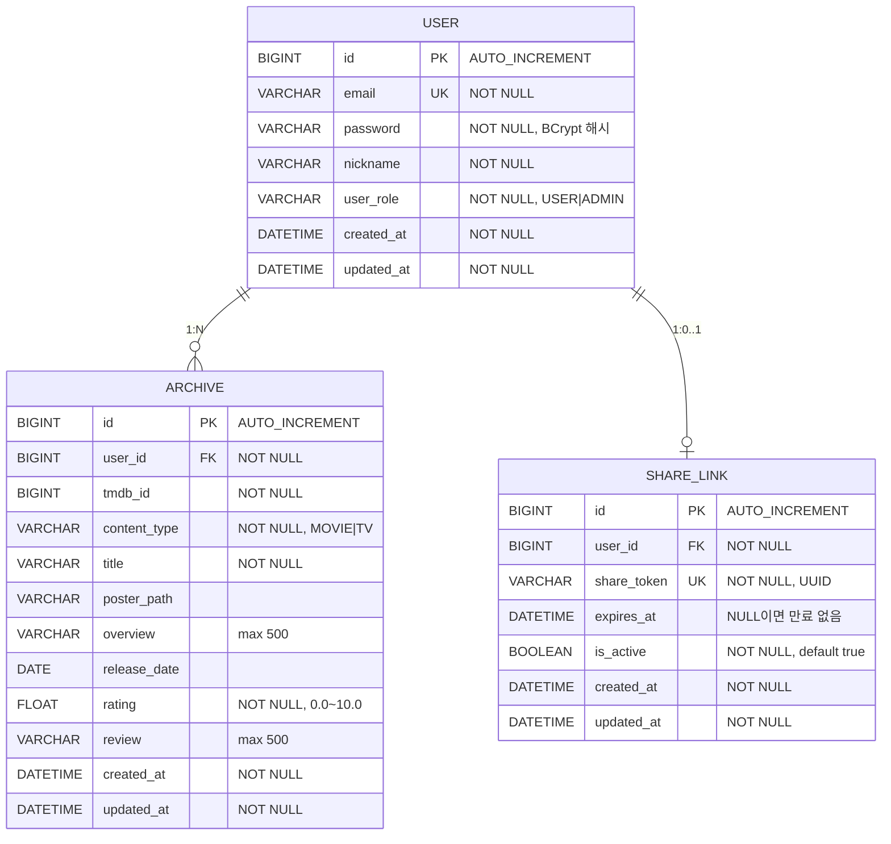

# 🎬 CinemaNote

> 영화와 드라마를 검색하고, 나만의 아카이브로 기록하고, 링크 하나로 공유하는 콘텐츠 아카이빙 서비스


---

## 기능 소개

- **회원 관리** — 이메일/비밀번호 기반 회원가입 및 로그인. 세션 방식으로 인증 상태를 유지합니다.
- **콘텐츠 검색** — TMDB(The Movie Database) API를 통해 영화·드라마를 검색하고 인기작, 최고 평점작, 장르 목록을 조회합니다.
- **아카이브 CRUD** — 관람한 영화·드라마를 아카이브로 저장하고, 개인 별점과 리뷰를 남깁니다. 동일 콘텐츠의 중복 저장을 방지합니다.
- **공유 링크** — 유저 단위의 공유 링크를 생성해 자신의 전체 아카이브 목록을 외부에 공개합니다. 로그인 없이 UUID 토큰으로 페이징 조회가 가능하며, 언제든지 링크를 비활성화할 수 있습니다.

---

## 기술 스택

### Backend

| 구분 | 기술 |
|------|------|
| Language | Java 21 |
| Framework | Spring Boot 3.5.11, Spring Security, Spring WebFlux |
| Database | MySQL, Spring Session JDBC |
| ORM | Spring Data JPA (Hibernate) |
| External API | TMDB API v3 |
| Build Tool | Gradle |

### Frontend

| 구분 | 기술 |
|------|------|
| Language | JavaScript (ES Module) |
| Framework | Vue 3 (Composition API) |
| Build Tool | Vite 5 |
| 상태 관리 | Pinia |
| 라우팅 | Vue Router 4 |
| UI 라이브러리 | Element Plus |
| HTTP 클라이언트 | Axios |

---

## 프로젝트 구조

### Backend

```
src/main/java/org/example/cinemanote
├── auth/
│   ├── annotation/          # @AuthUser — 인증된 유저를 컨트롤러 파라미터로 주입
│   ├── controller/          # 회원가입·로그인·로그아웃 엔드포인트
│   ├── dto/                 # SignupRequest/Response, SigninRequest/Response
│   ├── resolver/            # AuthUserArgumentResolver
│   └── service/             # AuthService, CustomUserDetailsService
├── domain/
│   ├── archive/
│   │   ├── controller/      # ArchiveController
│   │   ├── dto/             # ArchiveCreateRequest, ArchiveUpdateRequest, ArchiveResponse
│   │   ├── entity/          # Archive
│   │   ├── repository/      # ArchiveRepository
│   │   └── service/         # ArchiveService
│   ├── shareLink/
│   │   ├── controller/      # ShareController
│   │   ├── dto/response/    # ShareLinkResponse, SharedArchiveResponse, SharedArchivesPageResponse
│   │   ├── entity/          # ShareLink
│   │   ├── repository/      # ShareLinkRepository
│   │   └── service/         # ShareService
│   ├── tmdb/
│   │   ├── client/          # TmdbClient (WebClient 기반)
│   │   ├── controller/      # TmdbMovieController, TmdbTvController
│   │   ├── dto/response/    # TmdbMovieDetailResponse 등 각종 TMDB 응답 DTO
│   │   └── service/         # TmdbMovieService, TmdbTvService
│   └── user/
│       ├── entity/          # User
│       └── repository/      # UserRepository
└── global/
    ├── common/              # BaseEntity, Const, UserRole
    ├── config/              # SecurityConfig, WebClientConfig, WebMvcConfig
    ├── exception/           # CustomException, ErrorCode, GlobalExceptionHandler
    └── response/            # ApiResponse<T>, PageResponse<T>
```

### Frontend

```
frontend/src
├── api/
│   ├── axios.js             # Axios 인스턴스 (withCredentials, baseURL 설정)
│   ├── auth.js              # 회원가입·로그인·로그아웃 API
│   ├── archive.js           # 아카이브 CRUD API
│   ├── share.js             # 공유 링크 생성·비활성화·조회 API
│   └── tmdb.js              # TMDB 영화·드라마 검색 API
├── components/
│   ├── AppHeader.vue        # 상단 네비게이션 바 (로그인 상태 반영)
│   ├── ArchiveCard.vue      # 아카이브 카드 컴포넌트 (readonly 모드 지원)
│   ├── ShareLinkBox.vue     # 공유 링크 표시·복사 컴포넌트
│   └── StopShareModal.vue   # 공유 중지 확인 모달
├── stores/
│   └── auth.js              # Pinia 인증 스토어 (로그인 상태 전역 관리)
├── router/
│   └── index.js             # Vue Router 설정 (인증 가드 포함)
└── views/
    ├── LoginView.vue         # 로그인 페이지
    ├── SignupView.vue        # 회원가입 페이지
    ├── ArchiveView.vue       # 내 아카이브 목록 (공유 링크 관리 포함)
    ├── ArchiveCreateView.vue # 아카이브 생성 (TMDB 영화·드라마 검색 포함)
    ├── ArchiveDetailView.vue # 아카이브 상세 조회
    ├── ArchiveEditView.vue   # 아카이브 별점·리뷰 수정
    └── SharedView.vue        # 공유된 아카이브 열람 ({닉네임}의 아카이브 표시)
```

| 경로 | 뷰 | 인증 필요 |
|------|-----|:---------:|
| `/login` | LoginView | X |
| `/signup` | SignupView | X |
| `/` | ArchiveView | O |
| `/archive/new` | ArchiveCreateView | O |
| `/archive/:id` | ArchiveDetailView | O |
| `/archive/:id/edit` | ArchiveEditView | O |
| `/share/:token` | SharedView | X |

---

## API 명세

### 인증

| Method | Endpoint | 설명 | 인증 |
|--------|----------|------|:----:|
| POST | `/signup` | 회원가입 (이메일·비밀번호·닉네임) | X |
| POST | `/signin` | 로그인 (세션 발급) | X |
| POST | `/signout` | 로그아웃 (세션 만료) | O |

### 아카이브

| Method | Endpoint | 설명 | 인증 |
|--------|----------|------|:----:|
| POST | `/api/archives` | 영화·드라마 아카이브 생성 | O |
| GET | `/api/archives` | 내 아카이브 목록 페이징 조회 (기본 10개, createdAt 내림차순) | O |
| GET | `/api/archives/{archiveId}` | 특정 아카이브 단건 조회 | O |
| PATCH | `/api/archives/{archiveId}` | 아카이브 별점·리뷰 수정 | O |
| DELETE | `/api/archives/{archiveId}` | 아카이브 삭제 | O |

### 공유 링크

| Method | Endpoint | 설명 | 인증 |
|--------|----------|------|:----:|
| POST | `/api/share` | 공유 링크 생성 (이미 활성 링크가 있으면 기존 링크 반환, 멱등성 보장) | O |
| DELETE | `/api/share` | 공유 링크 비활성화 | O |
| GET | `/api/share/{shareToken}` | 공유 링크로 해당 유저의 전체 아카이브 페이징 조회 (응답에 nickname 포함) | X |

### TMDB 영화

| Method | Endpoint | 설명 | 인증 |
|--------|----------|------|:----:|
| GET | `/api/1/movies/search?query=&page=` | 영화 검색 | X |
| GET | `/api/1/movies/popular?page=` | 인기 영화 목록 | X |
| GET | `/api/1/movies/top-rated?page=` | 최고 평점 영화 목록 | X |
| GET | `/api/1/movies/genres` | 영화 장르 목록 | X |
| GET | `/api/1/movies/{movieId}` | 영화 상세 조회 | X |

### TMDB 드라마

| Method | Endpoint | 설명 | 인증 |
|--------|----------|------|:----:|
| GET | `/api/1/tv/search?query=&page=` | 드라마 검색 | X |
| GET | `/api/1/tv/popular?page=` | 인기 드라마 목록 | X |
| GET | `/api/1/tv/top-rated?page=` | 최고 평점 드라마 목록 | X |
| GET | `/api/1/tv/genres` | 드라마 장르 목록 | X |
| GET | `/api/1/tv/{tvId}` | 드라마 상세 조회 | X |

> 모든 TMDB 엔드포인트는 선택적 `language` 쿼리 파라미터를 지원하며, 기본값은 `ko-KR`입니다.

---

## ERD



---

## 기술적 의사결정

### 1. TMDB API 연동에 WebClient(WebFlux) 사용

**문제:**
영화·드라마 아카이브 생성 시, TMDB에서 제목·포스터·줄거리 등 콘텐츠 상세 정보를 가져와야 합니다. 동기 HTTP 클라이언트(RestTemplate 등)를 사용하면 외부 API 응답을 기다리는 동안 쓰레드가 블로킹됩니다.

**결정:**
Spring WebFlux의 `WebClient`를 사용해 TMDB API를 비동기·논블로킹 방식으로 호출합니다.

**이유:**
외부 API 호출은 응답 지연이 발생하기 쉬운 I/O 작업입니다. `WebClient`를 사용하면 쓰레드를 점유하지 않고 응답을 기다릴 수 있어 서버 자원을 효율적으로 활용할 수 있습니다. 또한 커넥션 풀(최대 50개), TCP 타임아웃(3초), 읽기/쓰기 타임아웃(각 5초)을 명시적으로 설정해 외부 API 장애가 서버 전체로 전파되지 않도록 격리했습니다.

---

### 2. 공유 링크 토큰에 PK(숫자 ID) 대신 UUID 사용

**문제:**
공유 링크를 `/api/share/{id}` 형태로 PK를 그대로 노출하면, 순차적인 숫자 ID로 인해 다른 유저의 공유 링크를 쉽게 추측·열람할 수 있습니다.

**결정:**
공유 링크 식별자로 `UUID.randomUUID()`로 생성한 토큰(`shareToken`)을 사용하고, URL에는 이 토큰만 노출합니다.

**이유:**
UUID는 128비트 무작위 값이므로 브루트포스로 유효한 토큰을 추측하는 것이 사실상 불가능합니다. PK를 외부에 노출하지 않음으로써 다른 유저의 공유 링크 무단 접근을 방지하고, 링크를 알고 있는 사람만 접근 가능한 "비공개 공유" 의미를 구현할 수 있습니다.

---

### 3. 인증 방식으로 JWT 대신 세션(JDBC 세션 스토어) 선택

**문제:**
사용자 인증 방식으로 Stateless JWT와 Stateful 세션 중 무엇을 선택할지 결정해야 했습니다.

**결정:**
Spring Session + JDBC 기반의 서버 사이드 세션을 사용합니다. 세션 데이터는 MySQL 데이터베이스에 저장되며, 만료 시간은 30분입니다.

**이유:**
MVP 단계에서는 서버가 단일 인스턴스로 운영되므로 JDBC 세션 스토어로도 확장성 문제가 없습니다. 또한 세션 방식은 서버에서 즉시 세션을 무효화할 수 있어 강제 로그아웃·보안 이슈 대응이 JWT보다 용이합니다. 추후 다중 인스턴스 운영이 필요해질 경우 Redis 세션 스토어로 전환을 고려합니다.

---

## 실행 방법

### 사전 요구사항

- Java 21 이상
- Node.js 18 이상
- MySQL 8.0 이상 (데이터베이스 및 사용자 생성 필요)
- TMDB API Key ([https://www.themoviedb.org/settings/api](https://www.themoviedb.org/settings/api) 에서 발급)

### 환경변수 설정

프로젝트 루트에 `.env` 파일을 생성하고 아래 내용을 작성합니다.

```dotenv
DB_URL=jdbc:mysql://localhost:3306/{데이터베이스명}?useSSL=false&serverTimezone=Asia/Seoul&allowPublicKeyRetrieval=true
DB_USERNAME={MySQL 사용자명}
DB_PASSWORD={MySQL 비밀번호}
TMDB_API_KEY={TMDB API 키}
```

또는 `application.yml`을 직접 수정합니다.

```yaml
spring:
  datasource:
    url: jdbc:mysql://localhost:3306/{데이터베이스명}
    username: {MySQL 사용자명}
    password: {MySQL 비밀번호}

tmdb:
  api-key: {TMDB API 키}
  base-url: https://api.themoviedb.org/3
```

### 백엔드 실행

```bash
git clone https://github.com/{username}/cinemanote.git
cd cinemanote
./gradlew bootRun
```

> Spring Boot 실행 시 `ddl-auto: update` 설정으로 테이블이 자동 생성됩니다.

### 프론트엔드 실행

```bash
cd frontend
npm install
npm run dev
```

> 개발 서버는 기본적으로 `http://localhost:5173`에서 실행되며, API 요청은 `http://localhost:8080`으로 프록시됩니다.

---

## 향후 계획

- [ ] 공유 링크 만료 시간 설정 기능 추가 (expiresAt)
- [ ] Redis 세션 스토어로 전환 (다중 인스턴스 대응)
- [ ] 아카이브 검색·필터링 기능 (제목 검색, 콘텐츠 타입 필터, 별점 범위 필터)
- [ ] 아카이브 통계 기능 (관람 편수, 평균 별점, 장르 분포)
- [ ] 소셜 로그인(OAuth2) 연동
